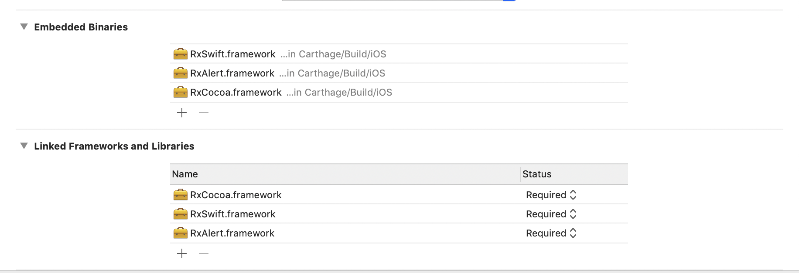

# RxAlert

## Overview

We have made it easy to implement UIAlertController using RxSwift.


|build|status|
|:-------|:---|
|travis CI|[](https://travis-ci.org/RxSwiftCommunity/RxAlert)|

## Carthage

Add following to Cartfile:

```
github "RxSwiftCommunity/RxAlert"
```

## carthage tutorial
Add as below image.



If you do not do this, the following log will be output

```bash
Reason: image not found
```
App hung😱!


## Cocoapods

[Cocoapods RxUIAlert](https://cocoapods.org/pods/RxUIAlert)

edit Podfile:

```
vi $(PROJECT_ROOT)/Podfile
```

Add one line following 

```
pod 'RxUIAlert'
```

## Use it

***Via SSH***: For those who plan on regularly making direct commits, cloning over SSH may provide a better experience (which requires uploading SSH keys to GitHub):

```
$ git clone git@github.com:RxSwiftCommunity/RxAlert.git
```
***Via https***: For those checking out sources as read-only, HTTPS works best:

```
$ git clone https://github.com/RxSwiftCommunity/RxAlert.git
```


## Before use it

Execute the following CLI.

If not, please [install it](https://cocoapods.org/).


```
$ pod install
```

## Sample code

```
alert(title: "RxAlert",
              message: "RxAlert Message",
              actions: [AlertAction(title: "OK", type: 0, style: .default)],
              vc: self).observeOn(MainScheduler.instance)
            .subscribe(onNext: { index in
                print ("index: \(index)")
                
            }).disposed(by: disposeBag)
```

[LICENCE](https://github.com/RxSwiftCommunity/RxAlert/blob/master/LICENSE)

Copyright (c) RxSwiftCommunity
